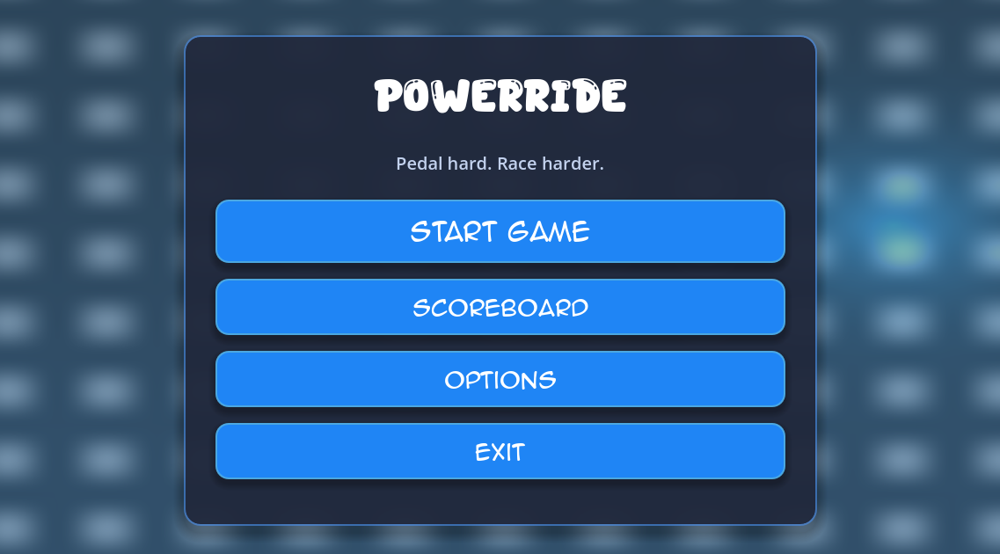

PowerRide
==========

Showcase Godot 4.5 (.NET/C#) project for a virtual bike/ergometer experience with a styled main menu.

## 🧭 What's inside
- Styled main menu with Start, Scoreboard, Options, and Exit in [scenes/ui/MainMenu.tscn](scenes/ui/MainMenu.tscn)
- Button logic in [scenes/ui/MainMenu.cs](scenes/ui/MainMenu.cs) for scene changes or quitting
- Default startup scene set to the main menu via [project.godot](project.godot)
- Included display fonts (Super Meatball, Chocolate Adventure, animeace2) for the UI look

## 🛠️ Quick start
- Requirements: Godot 4.5 (C# profile)
- Open the project file [project.godot](project.godot) in Godot
- Run the main menu scene with `F6` on [scenes/ui/MainMenu.tscn](scenes/ui/MainMenu.tscn) or launch the full game with `F5`

## 🎮 Menu actions
- Start Game: load the game scene (default [scenes/ui/RowerSimulatorUI.tscn](scenes/ui/RowerSimulatorUI.tscn))
- Scoreboard: placeholder for results
- Options: placeholder for settings
- Exit: quit the application

## 🗂️ Project layout
- scenes/ui: UI scenes and scripts (main menu)
- src: lower-level logic (e.g., Bluetooth, FTMS rower simulator)
- fonts: `.ttf` display fonts stored in the project root

## 🎨 Icons & assets
- App icon: [icon.svg](icon.svg)
- Fonts: bundled display fonts listed above

## 🤝 Contributing / dev flow
- Branch naming: `SCRUM-XX`
- Commits: Conventional Commits (`feat:`, `fix:`, `docs:`...)
- PRs: target `main`
